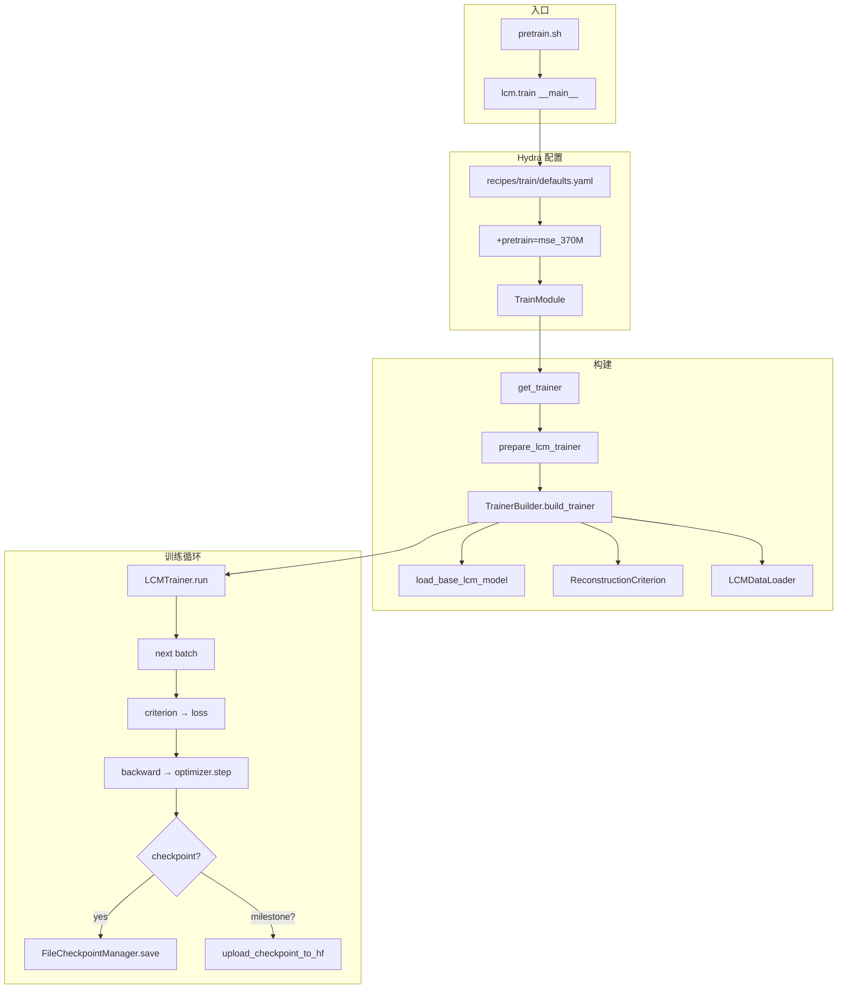
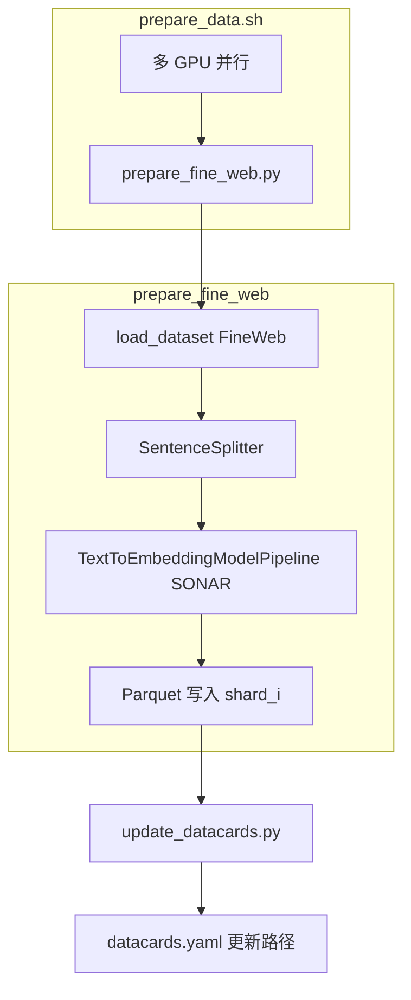

# LCM Core Logic Map

本文档从入口脚本出发，梳理 Large Concept Model (LCM) 项目的核心逻辑链，包括数据预处理、训练、评估、checkpoint 管理等模块及其调用关系。

---

## 一、项目结构概览

```
large_concept_model/
├── lcm/                          # 核心包
│   ├── train/                    # 训练入口与 Trainer
│   ├── models/                   # 模型定义与加载
│   ├── datasets/                 # 数据加载与 pipeline
│   ├── evaluation/               # 评估入口与任务
│   ├── inference/                # 推理（generator/scorer）
│   ├── nn/                       # 神经网络组件
│   └── utils/                    # 工具（HF、distributed、logging）
├── scripts/                      # 数据预处理脚本
├── recipes/train/                # Hydra 训练配置
├── quick_runners/                # 快捷运行脚本
└── docs/                         # 文档
```

---

## 二、入口与调用链

### 2.1 训练入口

```
pretrain.sh / train_780m.sh
  └── torch.distributed.run -m lcm.train launcher=standalone +pretrain=mse_780M ...

lcm/train/__main__.py
  └── @hydra.main(config_path="../../recipes/train", config_name="defaults.yaml")
  └── main(config) → asyncio.run(run(config))
  └── run(config):
       ├── launcher = hydra.utils.instantiate(config.launcher)   # submitit / standalone
       ├── train_module = TrainModule(train_config)
       └── launcher.schedule(train_module)
           └── TrainModule.run() → get_trainer(config) → trainer.run()
```

**配置来源：**

| 配置项 | 来源 | 说明 |
|--------|------|------|
| `pretrain` | `recipes/train/pretrain/mse_370M.yaml` 等 | 模型架构、criterion、LR、数据 |
| `launcher` | `recipes/common/launcher/standalone.yaml` | 本地 / submitit |
| `trainer` | recipe 中的 `# @package trainer` | `_trainer_: lcm.train.lcm.trainer.prepare_lcm_trainer` |

### 2.2 数据预处理入口

```
prepare_data.sh
  └── 多 GPU 并行：CUDA_VISIBLE_DEVICES=$i python scripts/prepare_fine_web.py ...
  └── 完成后：python scripts/update_datacards.py ...

scripts/prepare_fine_web.py
  └── load_dataset("HuggingFaceFW/fine-web-edu")
  └── SentenceSplitter → TextToEmbeddingModelPipeline (SONAR)
  └── Parquet 输出 (train/validation split)
```

### 2.3 评估入口

```
python -m lcm.evaluation [predictor=lcm] [task=xsum] ...

lcm/evaluation/__main__.py
  └── cfg_from_cli() → cfg, launcher_opts
  └── local.main(cfg) 或 slurm.main(cfg, launcher_opts)
  └── 加载 predictor (lcm / two_tower_diffusion_lcm / huggingface 等)
  └── 执行 task (xsum / xlsum / cnn_dailymail / lcm_generation 等)
```

---

## 三、训练逻辑链

### 3.1 Trainer 解析与创建

```
lcm/train/common.py
  └── get_trainer(train_config)
       └── _parse_training_config(train_config)
            ├── trainer_cls_or_func = train_config._trainer_
            ├── hydra.utils.get_object(trainer_cls_or_func)
            └── trainer_obj(typed_config)
```

**Base LCM 训练器：**

```
lcm/train/lcm/trainer.py
  └── prepare_lcm_trainer(config) → LCMTrainer
       └── TrainerBuilder.build_trainer()
            ├── create_model() → load_base_lcm_model / load_two_tower_diffusion_lcm_model
            ├── create_criterion() → ReconstructionCriterion (next_sentence_mse)
            ├── create_data_loaders() → LCMDataLoader
            ├── checkpoint_manager.has_checkpoint() → 若有则 trainer.restore()
            └── 返回 LCMTrainer
```

### 3.2 模型加载

```
lcm/models/base_lcm/loader.py
  └── load_base_lcm_model (StandardModelLoader)
       └── create_base_lcm_model(config)
       └── convert_lcm_checkpoint()  # 去除 DDP "module." 前缀

lcm/models/two_tower_diffusion_lcm/loader.py
  └── load_two_tower_diffusion_lcm_model
```

**模型架构注册：**

- `lcm/utils/model_type_registry.py`：`lcm_model_type_registry`
- `lcm/models/base_lcm/builder.py`：`lcm_archs`（base_lcm_60M / 130M / 250M / 370M / 780M / 1_6B）
- `lcm/models/two_tower_diffusion_lcm/builder.py`：two_tower 架构

### 3.3 单步训练流程

```
LCMTrainer.run()
  └── while step_nr < max_steps:
       ├── batch = next(training_data_loader)
       ├── loss_term = criterion(batch)
       ├── loss_term.loss.backward()
       ├── optimizer.step()
       ├── lr_scheduler.step()
       ├── 若 step_nr % checkpoint_every_n_steps == 0: checkpoint_manager.save_checkpoint()
       ├── 若 step_nr % save_model_every_n_steps == 0: 保存 model.pt
       ├── 若 checkpoint_milestones: 按 token 数保存到 HF Hub
       └── step_nr += 1
```

### 3.4 Criterion（MSE Base LCM）

```
lcm/train/mse_lcm/criterion.py
  └── ReconstructionCriterion (next_sentence_mse)
       └── __call__(batch)
            ├── input_embeddings, target_mask = prepare_input_and_mask(batch)
            ├── model_output = model(input_embeddings)
            └── compute_standard_mse(model_output, target_mask, batch.target_embeddings)
```

---

## 四、数据流逻辑链

### 4.1 Datacard 与数据集配置

```
lcm/datacards/datacards.yaml  (或 scripts/update_datacards.py 更新)
  └── 定义 dataset name → parquet 路径、schema

recipes/train/pretrain/mse_370M.yaml
  └── training_data: [{ name: "pretraining_data=train" }]
  └── validation_data: [{ name: "pretraining_data=validation" }]
```

### 4.2 Parquet 数据加载

```
lcm/datasets/dataloading.py
  └── SingleParquetDatasetDataloader
       └── define_parquet_dataset() → stream_parquet_fragments()
       └── build_batching_loop_over_one_table()
       └── materialize_sequence() → EmbeddingsBatch

lcm/datasets/parquet_utils.py
  └── filter_document_by_quality, filter_long_short_sentence_document
  └── prefix_and_suffix_one_list_column (BOD/EOT)
  └── pyarrow_table_to_torch_dict
```

### 4.3 Batch 格式

```
lcm/datasets/batch.py
  └── EmbeddingsBatch: input_embeddings, target_embeddings, mask 等
  └── LCMInput: prepare_input(), prepare_target_mask()
```

---

## 五、Checkpoint 与 HuggingFace Hub

### 5.1 本地 Checkpoint

```
lcm/train/trainer.py
  └── FileCheckpointManager (fairseq2)
  └── checkpoint_dir = output_dir/checkpoints
  └── 保存：optimizer, lr_scheduler, model, rng_bag, step_nr
  └── restore() → load_last_checkpoint() → load_state_dict()
```

### 5.2 HuggingFace Hub 上传 / 下载

```
lcm/utils/hf_upload.py
  └── upload_checkpoint_to_hf()  # 上传到 hf_repo_id

lcm/utils/huggingface_checkpoint_utils.py
  └── HuggingFaceCheckpointManager.save_checkpoint()
  └── 文件名：checkpoint_step_{step}_loss_{loss:.4f}.pth

lcm/utils/hf_upload.py
  └── download_checkpoint_folder_from_hf()  # decay_from_pretrain 等场景
```

### 5.3 训练模式与 Checkpoint 加载

| 模式 | 配置 | Checkpoint 来源 |
|------|------|-----------------|
| **pretrain** | `training_mode: pretrain` | 无 / 本地 output_dir |
| **pretrain resume** | `hf_checkpoint_filename` 非空 | HF Hub 或本地 |
| **decay_from_pretrain** | `training_mode: decay_from_pretrain` | HF Hub 指定 pretrain checkpoint |
| **finetune** | `training_mode: finetune` | `model_config_or_name` 指向已注册模型 |

---

## 六、脚本与 Quick Runners

### 6.1 数据预处理脚本

| 脚本 | 功能 |
|------|------|
| `scripts/prepare_fine_web.py` | FineWeb 流式处理 → SONAR 嵌入 → Parquet |
| `scripts/prepare_c4.py` | C4 数据处理 |
| `scripts/prepare_wikipedia.py` | Wikipedia 数据处理 |
| `scripts/prepare_tom_tracking.py` | ToM Tracking 下游数据 |
| `scripts/update_datacards.py` | 更新 datacards.yaml 中的路径 |
| `scripts/fit_embedding_normalizer.py` | 拟合 SONAR 嵌入归一化器 |

### 6.2 训练 Quick Runners

| 脚本 | 功能 |
|------|------|
| `pretrain.sh` | 预训练入口，支持 --model=mse_780M / two_tower_780M 等 |
| `prepare_data.sh` | 多 GPU 并行 prepare_fine_web |
| `quick_runners/post_training/lcm_370m_tom_tracking.sh` | ToM Tracking 微调（submitit） |

---

## 七、评估逻辑链

```
lcm/evaluation/run.py (通过 __main__ 间接调用)
  └── local.main(cfg) / slurm.main(cfg)
       └── 根据 cfg.predictor 加载 predictor
            ├── lcm → predictors/lcm.py (Base LCM)
            ├── two_tower_diffusion_lcm → predictors/two_tower_diffusion_lcm.py
            └── huggingface / llama / gemma 等
       └── 根据 cfg.task 执行 task
            ├── xsum, xlsum, cnn_dailymail
            └── lcm_generation
       └── 计算 metrics (similarity, coherence, round_trip 等)
```

---

## 八、Mermaid 流程图

### 8.1 训练主流程



### 8.2 数据预处理流程



---

## 九、相关文档索引

| 文档 | 说明 |
|------|------|
| [logic_chains/fineweb_preprocessing.md](logic_chains/fineweb_preprocessing.md) | FineWeb 预处理详细逻辑链 |
| [logic_chains/train_base_lcm.md](logic_chains/train_base_lcm.md) | Base LCM 训练逻辑链 |
| [logic_chains/train_two_tower_lcm.md](logic_chains/train_two_tower_lcm.md) | Two-Tower Diffusion LCM 训练逻辑链 |
| [logic_chains/training_summary.md](logic_chains/training_summary.md) | 训练能力总结（LR 调度、断点恢复、W&B） |
| [logic_chains/lcm_vs_our_code_comparison.md](logic_chains/lcm_vs_our_code_comparison.md) | LCM 与 SentenceSSM 能力对比 |
| [code_run_guide.md](code_run_guide.md) | CLI 命令示例（pretrain、resume、decay） |
| [Hydra.md](Hydra.md) | Hydra 配置说明 |
